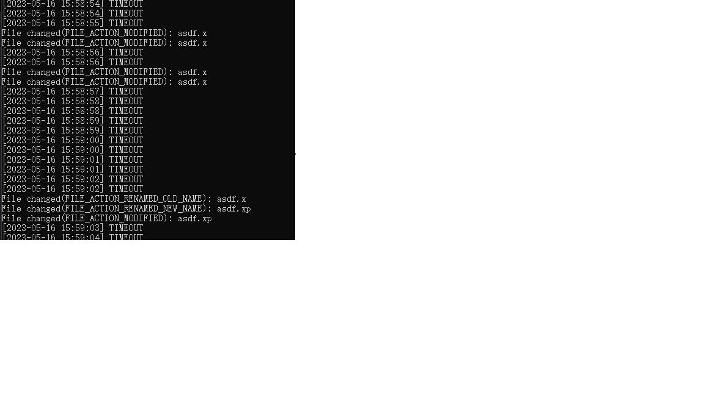

# how-to-iocp

## what is IOCP

> [IOCP - I/O Completion Ports](https://learn.microsoft.com/en-us/windows/win32/fileio/i-o-completion-ports) <br/>

I/O completion ports provide an efficient threading model for processing multiple asynchronous I/O requests on a multiprocessor system. When a process creates an I/O completion port, the system creates an associated queue object for threads whose sole purpose is to service these requests. Processes that handle many concurrent asynchronous I/O requests can do so more quickly and efficiently by using I/O completion ports in conjunction with a pre-allocated thread pool than by creating threads at the time they receive an I/O request.

## header file
`IoAPI.h (include Windows.h);` <br/>
[`ioapiset.h`](https://learn.microsoft.com/en-us/windows/win32/api/ioapiset/)

## interface
```c
// Cancels all pending input and output (I/O) operations that are issued by the calling thread for the specified file.
// The function does not cancel I/O operations that other threads issue for a file handle.
BOOL CancelIo(
  [in] HANDLE hFile
);

// Marks any outstanding I/O operations for the specified file handle.
// The function only cancels I/O operations in the current process, regardless of which thread created the I/O operation.
BOOL CancelIoEx(
  [in]           HANDLE       hFile,
  [in, optional] LPOVERLAPPED lpOverlapped
);

// Marks pending synchronous I/O operations that are issued by the specified thread as canceled.
BOOL CancelSynchronousIo(
  [in] HANDLE hThread
);

// Creates an input/output (I/O) completion port and associates it with a specified file handle, 
// or creates an I/O completion port that is not yet associated with a file handle, allowing association at a later time.
HANDLE WINAPI CreateIoCompletionPort(
  _In_     HANDLE    FileHandle,
  _In_opt_ HANDLE    ExistingCompletionPort,
  _In_     ULONG_PTR CompletionKey,
  _In_     DWORD     NumberOfConcurrentThreads
);

// Sends a control code directly to a specified device driver, causing the corresponding device to perform the corresponding operation.
BOOL DeviceIoControl(
  [in]                HANDLE       hDevice,
  [in]                DWORD        dwIoControlCode,
  [in, optional]      LPVOID       lpInBuffer,
  [in]                DWORD        nInBufferSize,
  [out, optional]     LPVOID       lpOutBuffer,
  [in]                DWORD        nOutBufferSize,
  [out, optional]     LPDWORD      lpBytesReturned,
  [in, out, optional] LPOVERLAPPED lpOverlapped
);

// Retrieves the results of an overlapped operation on the specified file, named pipe, or communications device.
// To specify a timeout interval or wait on an alertable thread, use GetOverlappedResultEx.
BOOL GetOverlappedResult(
  [in]  HANDLE       hFile,
  [in]  LPOVERLAPPED lpOverlapped,
  [out] LPDWORD      lpNumberOfBytesTransferred,
  [in]  BOOL         bWait
);

// Retrieves the results of an overlapped operation on the specified file, named pipe, or communications device within the specified time-out interval.
// The calling thread can perform an alertable wait.
BOOL GetOverlappedResultEx(
  [in]  HANDLE       hFile,
  [in]  LPOVERLAPPED lpOverlapped,
  [out] LPDWORD      lpNumberOfBytesTransferred,
  [in]  DWORD        dwMilliseconds,
  [in]  BOOL         bAlertable
);

// Attempts to dequeue an I/O completion packet from the specified I/O completion port. 
// If there is no completion packet queued, the function waits for a pending I/O operation associated with the completion port to complete.
BOOL GetQueuedCompletionStatus(
  [in]  HANDLE       CompletionPort,
        LPDWORD      lpNumberOfBytesTransferred,
  [out] PULONG_PTR   lpCompletionKey,
  [out] LPOVERLAPPED *lpOverlapped,
  [in]  DWORD        dwMilliseconds
);

// Retrieves multiple completion port entries simultaneously. 
// It waits for pending I/O operations that are associated with the specified completion port to complete.
BOOL GetQueuedCompletionStatusEx(
  [in]  HANDLE             CompletionPort,
  [out] LPOVERLAPPED_ENTRY lpCompletionPortEntries,
  [in]  ULONG              ulCount,
  [out] PULONG             ulNumEntriesRemoved,
  [in]  DWORD              dwMilliseconds,
  [in]  BOOL               fAlertable
);

// Posts an I/O completion packet to an I/O completion port.
BOOL PostQueuedCompletionStatus(
  [in]           HANDLE       CompletionPort,
  [in]           DWORD        dwNumberOfBytesTransferred,
  [in]           ULONG_PTR    dwCompletionKey,
  [in, optional] LPOVERLAPPED lpOverlapped
);

```

